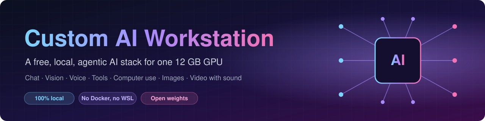
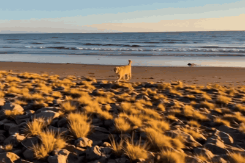
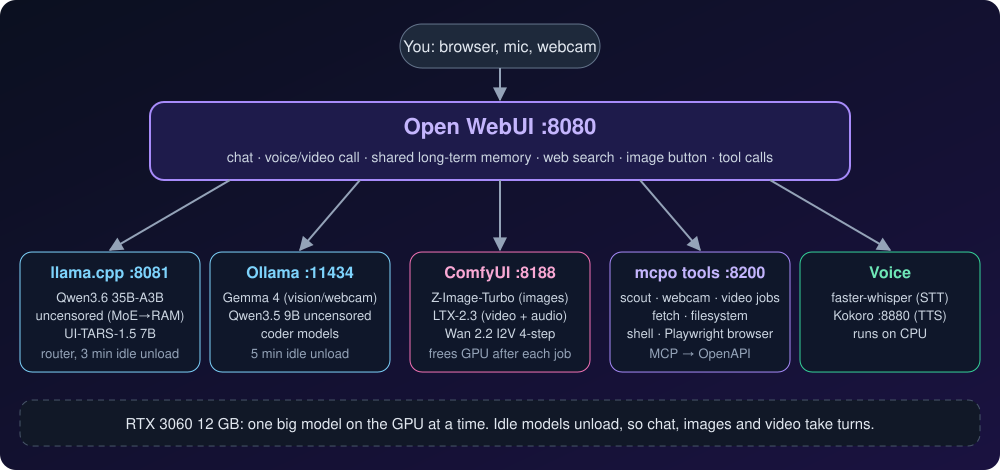
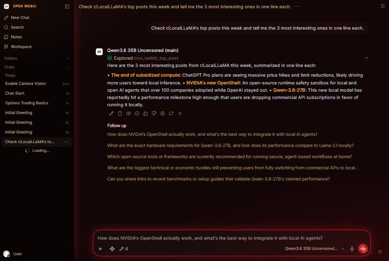

<p align="center">
  
</p>

<p align="center">
  <a href="LICENSE"></a>
  
  
  
  <a href="https://github.com/sponsors/Mr5elfDe5truct"></a>
  <br>
  
  
  
  
  
  
  
</p>

<p align="center">
  <b>One folder, one script, one 12 GB GPU.</b><br>
  A free, local, uncensored, agentic AI that chats, sees through your webcam, talks back, uses tools,
  drives your mouse and keyboard, and makes images and videos with sound.<br>
  Nothing leaves the machine except the web lookups the AI makes with its research tools.
</p>

---

## ✨ Showcase

Everything below was generated on the workstation itself (RTX 3060 12 GB, 32 GB RAM).

<table>
  <tr>
    <td align="center" width="50%">
      <br>
      <b>Text → video with sound</b> · LTX-2.3 distilled<br>
      <sub>4 s, 768×512, ~6 min · <a href="docs/assets/sample-ltx23-t2v.mp4">▶ watch with audio (MP4)</a></sub>
    </td>
    <td align="center" width="50%">
      <br>
      <b>Image → video</b> · Wan 2.2 I2V, LightX2V 4-step<br>
      <sub>5 s, 832×480, ~10 min, animated from the still below</sub>
    </td>
  </tr>
  <tr>
    <td align="center">
      <br>
      <b>Image from the chat window</b> · Z-Image-Turbo<br>
      <sub>1024×1024, ~30–45 s, asked for in Open WebUI</sub>
    </td>
    <td align="center">
      <br>
      <b>Text → image</b> · Z-Image-Turbo<br>
      <sub>the start frame for the Wan 2.2 clip above</sub>
    </td>
  </tr>
</table>

## 🧠 What it can do

| | Feature | How |
|---|---|---|
| 💬 | **Chat with uncensored models** | Qwen3.6 35B-A3B (MoE with experts in system RAM), Qwen3.8 27B for deep reasoning, Qwen3.5 9B, Gemma 4 |
| 👀 | **Webcam vision** | Open WebUI video call with Gemma 4, or the `webcam_snapshot` tool mid-chat |
| 🎙️ | **Voice in and out** | Whisper large-v3-turbo speech-to-text on the GPU; Kokoro text-to-speech, or VoxCPM2 for designed and cloned voices |
| 📞 | **Live calls** (Prestige) | Hands-free voice and webcam calls: Whisper, a Qwen3.5 vision model and VoxCPM2 all on the GPU at once, speech streamed as it's made, ~3 s from the end of your sentence to its voice |
| 🧰 | **Tools** | web search, web fetch, files, PowerShell (guarded), Playwright browser control |
| 🔭 | **Research scout** | Reddit, Hugging Face trending GGUFs and GitHub search, plus a Markdown scout report |
| 🖱️ | **Computer use** | Prestige's **Do it for me** (`/do`): Qwen3.8 27B or Nex-N2.5-mini sees the screen and drives the mouse and keyboard, with each step approved in a small panel; or UI-TARS Desktop driven by a local UI-TARS-1.5-7B |
| 🖼️ | **Images** | Qwen-Image-2.1 (good with text, signs and posters), its 4-step turbo, or Z-Image-Turbo through ComfyUI, from the image button or by asking |
| ✏️ | **Image editing** | Qwen-Image-2.1 by instruction ("make it night", "swap the car for a horse"), with an optional reference image or mask |
| 🧍 | **Reference images** | In Prestige: put a character or item from your own picture into a new image (Qwen-Image-2.1) or video (that image, or the picture itself, animated by LTX-2.5 with sound) |
| 🎬 | **Video** | LTX-2.5 text-to-video with audio, Wan 2.2 image-to-video, as background jobs |
| 🎵 | **Songs** (Prestige) | ACE-Step 1.5 turbo through ComfyUI: a style and lyrics (or the chat model writes them with `/song`) become a sung song, 30 s to 4 min |
| 🎧 | **Transcribe** (Prestige) | Drop a recording or a video into a chat: Phonon-2 writes it down and Nemotron 3 Diarization says who spoke when, then the chat model summarises it |
| 🧊 | **Picture to 3D** (Prestige) | Pixal3D (TencentARC) turns a picture into a textured 3D model (.glb) through ComfyUI's own nodes: 3 to 8 minutes and 4.3 to 7.3 GB of VRAM on the 3060 |
| 🗣️ | **Talking characters** (Prestige) | InfiniteTalk (MeiGen) through ComfyUI's own nodes: a face and a voice (Kokoro, VoxCPM2 or a recording) become a lip-synced video, ~4.5 min per 3 s of speech on the 3060 |
| 🗂️ | **Shared long-term memory** | every model reads and writes the same memory; chats are saved |
| 📚 | **Chat with your files** (Prestige) | Drop PDFs, Word documents, notes or a folder into a chat; Qwen3-Embedding 0.6B (Ollama) indexes them on this PC and answers cite the file and page |

## 🎩 Prestige desktop app

**[Prestige by R.G. Studios](https://github.com/Mr5elfDe5truct/prestige)** is a native Windows app for this stack, an alternative to the
Open WebUI window. It has streaming chat with every model, shared memory, a System dashboard with model load and unload, a Studio gallery
with image, video and song generation, voice conversation with an animated avatar, Live voice and webcam calls, webcam vision, and chat with your
own files (answers cite the file and page). Opening it starts the stack, and closing it
stops it. Download the installer from its [Releases](https://github.com/Mr5elfDe5truct/prestige/releases) page.

## 🏗️ How it fits together

<p align="center"></p>

| Port | Service | Notes |
|---|---|---|
| 8080 | Open WebUI | the app you use |
| 11434 | Ollama | Gemma 4, Qwen3.5 9B, Qwen3.5 2B / 4B (Prestige Live calls), Qwen3-Embedding 0.6B (Prestige Knowledge), coders; unloads after 5 min idle |
| 8081 | llama.cpp router | Qwen3.6 35B, Qwen3.8 27B and UI-TARS, one at a time; unloads after 3 min idle (`bin/llama-models.ini`) |
| 8188 | ComfyUI (headless) | its own install, or Comfy Desktop's; frees the GPU after each job |
| 8880 | Kokoro | text-to-speech on CPU |
| 8891 | Phonon server | Phonon-2 speech-to-text on the CPU (transcribe pack), the Whisper API shape; Prestige's Transcribe and, if you pick it, Live calls use it (`fermion serve phonon-2`) |
| 8890 | voice server | Whisper large-v3-turbo speech-to-text and VoxCPM2 voices, OpenAI-compatible, on the GPU when used; streams VoxCPM2 speech as raw PCM (`"stream": true`) and preloads both for Live calls (`/v1/audio/load`) (`tools/voice_server.py`) |
| 8200 | mcpo tool server | research, webcam, fetch, images, image edits, video jobs, files, shell, browser (`tools/mcpo-config.json`), plus tools added from Prestige's tool store (`data\mcpo-extra.json`), reloaded while it runs |

The 12 GB GPU holds one big model at a time. Everything unloads when idle, so chat, images and video take turns.
With two or more NVIDIA cards, the small models (Ollama) run on one card and the big model and ComfyUI on another, so
chat keeps going while a render runs. Small cards get smaller models and contexts. See [docs/GPUS.md](docs/GPUS.md).

## 🖥️ Hardware and models

**Reference PC:** NVIDIA RTX 3060 12 GB · AMD Ryzen 7 2700X · 32 GB RAM · Windows 11 · NVMe for chat models, HDD for video models.

| Role | Model | Runner | Size on disk | Speed on the 3060 |
|---|---|---|---|---|
| Main agent, uncensored, tools + vision | Qwen3.6-35B-A3B Heretic Q4_K_M (25 of 40 expert layers in RAM) | llama.cpp | ~21 GB | ~25–30 tok/s |
| Deep reasoning, uncensored, vision | Qwen3.8-27B HauhauCS Aggressive Q2_K_P, fully on the GPU with MTP drafting, 20k context | llama.cpp | ~10.9 GB | ~30–38 tok/s (Q3/IQ3 quants with layers in RAM: 5–8 tok/s) |
| Fast, fully on GPU, uncensored | Qwen3.5-9B Uncensored Q4_K_M | Ollama | 6.7 GB | fast |
| Vision / webcam | Gemma 4 (12B and e4b) | Ollama | 7–10 GB | good |
| Live calls (Prestige) | Qwen3.5 4B with Kokoro voices, Qwen3.5 2B beside VoxCPM2 (vision, no thinking, 16k context) | Ollama | 3.4 / 2.7 GB | ~55 / ~60 tok/s; 3.3 / 2.4 GB VRAM |
| Reading your files (Prestige Knowledge) | Qwen3-Embedding 0.6B | Ollama | 0.6 GB | ~1 GB VRAM while it reads |
| Computer use | UI-TARS-1.5-7B Q5_K_M | llama.cpp | ~5.5 GB | on demand |
| Images | Qwen-Image-2.1 Q4_K_M (uncensored), 20 steps, Qwen3-VL-8B text encoder | ComfyUI + GGUF | ~11.6 GB | ~80 s at 1024² (~110 s cold); peak 6–8 GB VRAM |
| Images, fast | Qwen-Image-2.1 Viggle 4-step turbo Q4_K_M | ComfyUI + GGUF | +4.2 GB | ~25 s at 1024² |
| Image editing | Qwen-Image-2.1 (same files) | ComfyUI + GGUF | — | ~2 min at 1024²; peak 8.3 GB VRAM |
| Reference image → new scene | Qwen-Image-2.1 or its turbo (same files) | ComfyUI + GGUF | — | ~2 min at 1024² (~2.2 min cold) |
| Image → video + audio | LTX-2.5 (same files), the picture as the first frame | ComfyUI + GGUF | — | ~4–11 min for 4 s at 768×512 (longer when the models load from disk; +2–3.5 min when Qwen-Image makes the first frame) |
| Images (alternative) | Z-Image-Turbo | ComfyUI | 21 GB | ~35–40 s at 1024² |
| Text → video + audio | LTX-2.5 22B distilled Q4_K_M, two-stage with the x2 latent upscaler | ComfyUI + GGUF | ~34 GB | ~3.5 min for 4 s at 768×512 from an NVMe drive (~9.5 min from an HDD); 5 s ~3.8 min, 10 s ~5.4 min, 1280×704 10 s ~10 min, all within 12 GB (part of the model streams from RAM) |
| Picture → 3D model | Pixal3D int8 (TencentARC, MIT) + DINOv3, TRELLIS.2 shape and texture VAEs, MoGe-2 (field of view), BiRefNet (cut-out); remeshed, UV-unwrapped, PBR textures baked at 4096 (`workflows/pixal3d-image-to-3d.api.json`) | ComfyUI (native) | ~9.3 GB | 3 to 8 min a model (203 s for a simple axe, 468 s for a detailed dragon), peak 4.3 to 7.3 GB VRAM; a 60 to 70 MB textured .glb. Shape upsampled at 1024 voxels and remeshed at 512 so detailed subjects fit 12 GB |
| Talking video (Prestige) | InfiniteTalk single-speaker (MeiGen, Apache-2.0) on Wan 2.1 I2V 14B 480p Q4_K_M + lightx2v step-distill LoRA, wav2vec2 speech encoder, 4 steps at 448×640, 81-frame parts chained on the last 9 frames (`workflows/infinitetalk-talking.api.json`; Prestige adds the parts) | ComfyUI (native) + GGUF | ~17.4 GB (+6.5 GB without the video pack) | 3.2 s of speech in 264 s, 8 s in 774 s (~255 s per 2.9 s part), peak 10.1 GB VRAM with the rest of Wan streamed from RAM; ComfyUI uses ~22 GB of system RAM while it runs |
| Image → video | Wan 2.2 I2V A14B LightX2V 4-step Q4_K_M | ComfyUI + GGUF | ~25 GB | ~10 min for 5 s |
| Long video (image → up to 4 chained shots) | Wan 2.2 I2V + Stable Video Infinity v2 PRO LoRAs (KJNodes, LayerStyle, Fill-Nodes, ReservedVRAM, Memory_Cleanup, essentials_mb, Easy-Use custom nodes) | ComfyUI | +2.5 GB of LoRAs | ~7 min for 4 shots of 49 frames at 480² |
| Songs (Prestige) | ACE-Step 1.5 turbo: ~2.4B diffusion model, Qwen3 0.6B text encoder and 1.7B language model for the audio codes, 8 steps, tiled audio decode | ComfyUI (native) | ~10 GB | 30 s of music in ~18 s, 2 min in ~44 s, 4 min in ~53 s; ~5.3 GB VRAM at any length (+20–60 s the first time after a big chat model unloads) |
| Transcribe (Prestige) | Phonon-2 (FermionResearch's 2-bit Parakeet TDT 0.6B v3, English) for the words, Nemotron 3 Diarization (NVIDIA, up to 8 speakers) in NeMo-Speech.cpp for who said what (`tools/transcribe.py`) | Phonon server (CPU) + NeMo-Speech.cpp (GPU) | 0.3 GB + 0.7 GB env | a 51 s two-person meeting in 6.3 s, a 1:42 three-person MP4 in 11.5 s; the 3 s of speech a Live turn has in ~0.3 s (Whisper turbo: ~0.7 s on the GPU) |
| Speech to text | Whisper large-v3-turbo (int8) | voice server (faster-whisper) | 1.6 GB | ~0.1–0.7 s a sentence on the GPU (~25 s on the CPU, so the CPU fallback is `base`) |
| Text to speech | Kokoro 82M | Kokoro-FastAPI | small | CPU, real time |
| Expressive speech | VoxCPM2 2B: designed voices, cloning from a short clip, 48 kHz | voice server | 5 GB | ~1.2× real time (first sound ~0.3 s when streamed); 6 GB VRAM, so chat models unload while it speaks (except the small Live model) |

### 🎛️ GPUs: one card, several cards, small cards

`start-all.ps1` reads the cards with `nvidia-smi` on every start and pins each service to a card:

| Mode | What runs where |
|---|---|
| `single` | everything on the biggest card (the only mode with one card) |
| `split` | **default with two or more cards**: Ollama and Open WebUI's embeddings on the second card, llama.cpp and ComfyUI on the biggest; the voice server joins the small card when it has 8 GB or more |
| `pool` | like split, but llama.cpp spreads the big model over every card |

With `"services": { "comfyui": "all" }`, ComfyUI also uses a second card for the parts that can move (the LTX
upscaler; VAEs and text encoders on request), while the diffusion model stays on the big card.
On cards other than 12 GB, llama.cpp sizes its offload to the card itself (`--fit`), Ollama's context drops to
16k (8k under 5.5 GB), and the installer picks Ollama models that fit the card they'll run on. Switch with
`.\start-all.ps1 -GpuMode pool`, or for good in `data\gpu-settings.json`. [docs/GPUS.md](docs/GPUS.md) has the details,
every setting, and measurements from an RTX 3060 12 GB + RTX 2060 6 GB.

## 🚀 Quick start

This repo holds the glue: launch scripts, configs, ComfyUI workflows, and the custom tool server. The installer
adds everything else (see [PLAN.md](PLAN.md) for the full build log and every source).

**1. Install.** You need Windows 10/11 (64-bit), an NVIDIA GPU with a current driver, and
about 40 GB free. One card of 6 GB or more works; 12 GB is what it's tuned for, and more cards are used if you have them. Download **Workstation-Setup.zip** from
[Releases](https://github.com/Mr5elfDe5truct/custom-ai-workstation/releases/latest), unzip it and double-click
**setup.cmd**. Or from PowerShell:

```powershell
irm https://raw.githubusercontent.com/Mr5elfDe5truct/custom-ai-workstation/main/install.ps1 -OutFile "$env:TEMP\install.ps1"
powershell -ExecutionPolicy Bypass -File "$env:TEMP\install.ps1"
```

It installs into `%USERPROFILE%\RG Studios\Workstation` (change it with `-Root`) and asks which model packs to get:

| Pack | What it adds | Size |
|---|---|---|
| `fast` | Qwen3.5 9B Uncensored (Ollama); Qwen3.5 4B when Ollama's card has under 7.5 GB | 6.7 GB |
| `vision` | Gemma 4 12B (Ollama); Qwen3-VL 8B on 7.5-10 GB cards, Qwen3.5 4B below | 8 GB |
| `main` | Qwen3.6 35B-A3B Heretic + vision (llama.cpp, needs 32 GB RAM) | 22 GB |
| `deep` | Qwen3.8 27B Uncensored + vision (llama.cpp), the strongest reasoner, fully on a 12 GB GPU | 11 GB |
| `voice` | Whisper large-v3-turbo speech-to-text and VoxCPM2 voices on the GPU (needs 8 GB+ VRAM), plus Qwen3.5 2B and 4B for Prestige's Live calls; without it, Open WebUI's CPU Whisper `base` is used | 18 GB |
| `images` | Qwen-Image-2.1 text-to-image, editing and reference images, its 4-step turbo (ComfyUI GGUF), and Z-Image-Turbo | 37 GB |
| `video` | Wan 2.2 image-to-video and LTX-2.5 text- and image-to-video (ComfyUI GGUF) | 60 GB |
| `computer` | UI-TARS 1.5 7B (llama.cpp); it then asks about Nex-N2.5-mini (+21.6 GB, 32 GB RAM; or `-Nex`), the model Prestige's Do it for me prefers | 7 GB |
| `music` | ACE-Step 1.5 turbo (ComfyUI) for Prestige's songs: Studio's Music tab and `/song` in chat | 10 GB |
| `transcribe` | Phonon-2 speech-to-text (CPU) and Nemotron 3 Diarization (NeMo-Speech.cpp, CUDA) for Prestige's Transcribe: recordings and videos to text with who said what | 1 GB |
| `3d` | Pixal3D for Prestige's Picture to 3D (ComfyUI): a picture to a textured .glb | 9.3 GB |
| `talk` | InfiniteTalk for Prestige's talking characters (ComfyUI): Wan 2.1 14B Q4_K_M, the lightx2v LoRA, InfiniteTalk's audio patch and wav2vec2 | 17.4 GB |

With any pack it also gets Qwen3-Embedding 0.6B (0.6 GB), which Prestige's Knowledge uses to read your files.

Along the way it installs the Visual C++ runtime, git, uv, Node.js, ffmpeg, Ollama and eSpeak NG with winget (and
winget itself if Windows doesn't have it); the newest llama.cpp CUDA build;
the Python envs for Open WebUI, the tool server, Kokoro and the voice server (from the pinned lists in `requirements\`); ComfyUI with the
GGUF nodes ([leejet's fork](https://github.com/leejet/ComfyUI-GGUF), which adds Qwen-Image-2.1) and KJNodes (or reuses
Comfy Desktop if you have it, which needs ComfyUI 0.37 or newer; 0.38 renders Qwen faster); the Desktop and Start Menu shortcuts; and
[Prestige](https://github.com/Mr5elfDe5truct/prestige). Then it starts everything once to check it works. Downloads
resume, so you can run it again to add packs or finish an interrupted install. Options:

```powershell
.\install.ps1 -Packs fast,images -Yes     # no questions
.\install.ps1 -Packs none                 # software only, no models
.\install.ps1 -NoPrestige -NoShortcuts    # skip the Prestige app and shortcuts
.\install.ps1 -GpuMode pool              # several GPUs: split (default, asked otherwise), pool or single
```

The configs use `{ROOT}` for the install folder; `start-all.ps1` writes the real paths to `data\runtime` on each start.
The workstation lives in your user folder, not Program Files, because its services write logs, data and models into it.

**2. Start it:**

```powershell
.\start-all.ps1          # starts everything and opens Open WebUI in its own app window
.\stop-all.ps1           # stops everything and closes the app window (leaves Comfy Desktop alone)
.\install-shortcut.ps1   # adds "Custom AI" and "Stop Custom AI" shortcuts (Custom AI starts services if needed)
.\start-computer-use.ps1 # opens UI-TARS Desktop so the AI can use your mouse and keyboard
```

If PowerShell blocks the script: `powershell -ExecutionPolicy Bypass -File .\start-all.ps1`.

**Desktop app:** Open WebUI opens in its own window with no tabs or address bar (Chrome, or Edge if Chrome isn't
installed), using a separate profile in `data\app-profile` so it gets its own taskbar entry.

- Run `.\install-shortcut.ps1` once to add a **Custom AI** shortcut to the Desktop and Start Menu. It starts the
  services if they aren't running, then opens the window.
- **Closing the window shuts everything down** (it runs `stop-all.ps1`). To keep the services up after closing,
  open it with `.\open-app.ps1 -KeepRunning`.
- The **Stop Custom AI** Start Menu shortcut stops everything without opening the window.
- Open WebUI is still at http://localhost:8080 in any browser.

**Themes:** Open WebUI gets a custom look, **Dragon Red & Gold** by default (black and crimson with gold highlights and a red glow).
Three more are built in: **Cyberpunk Neon**, **Glass** (frosted panels over a colored backdrop) and **Terminal HUD** (green on black).

<p align="center"></p>

- Switch with the palette button in the bottom-right corner, or press **Ctrl+Alt+T** to cycle. The choice is remembered.
- Pick the startup default with `.\start-all.ps1 -Theme dragon|neon|glass|hud|off` (`off` is Open WebUI's own look).
- Themes apply in Open WebUI's dark mode (Settings → General → Theme: Dark or System). OLED Dark overrides the colors.
- The theme lives in `theme/`. `start-all.ps1` copies it into Open WebUI's `custom.css` and `loader.js` on every start,
  so it survives `uv pip install -U open-webui`.

## 💡 Using it

- **Pick a model** at the top of the chat. Qwen3.6 35B is the best all-rounder; its first message after idling takes ~30–60 s to load.
  For hard problems (math, code, planning) pick **qwen3.8-27b-uncensored**: it thinks before answering and is the strongest reasoner here.
- **Talk to it** with the mic and voice-mode buttons. Whisper large-v3-turbo hears you (voice pack) and answers are spoken with Kokoro.
- **Other voices:** the voice server speaks with VoxCPM2 (`aria`, `sterling`, `nova`, `atlas`, `ember`, or a description such as
  "a cheerful old pirate"). Prestige can use it and clone a voice from a short clip. It needs ~6 GB of GPU memory, so the chat model
  unloads while it speaks and reloads for the next message; Kokoro stays the quick everyday voice.
- **Live calls** (Prestige): click **Live** and just talk; talk over it to interrupt, and turn the camera on so it sees you.
  Whisper turbo + VoxCPM2 + Qwen3.5 2B measure ~10.6 of 12 GB with the desktop (~1.4 GB free) and answer ~2.5–3.5 s after you stop
  talking; with a Kokoro voice it uses Qwen3.5 4B. The `voice` pack pulls both models.
- **Webcam:** voice mode → camera icon starts a video call (use Gemma 4). Or ask "take a webcam photo and tell me what you see".
- **Images:** the image button under the message box, or just ask for one (Qwen-Image-2.1; ask for a quick one to get its 4-step turbo).
- **Edit an image:** "edit C:\path\to.png: make it night". Add a second image as a reference (a face, product, outfit) or a black-and-white mask of the area to change.
- **Video:** "make a video of …" (LTX-2.5) or "animate this image: C:\path\to.png" (Wan 2.2). It returns a job id; ask "is video &lt;id&gt; done?".
- **Research:** "what's new on r/LocalLLaMA this week", "find trending GGUF models under 10 GB", or "run a scout report".
- **Files and commands:** "list what's in my Downloads", "run `nvidia-smi`". The shell blocks disk, format, registry, shutdown and user-account commands, and the model asks before deleting, installing or changing settings.
- **Browser control:** enable the **browser** tool for a chat, then "open github.com/ggml-org/llama.cpp/releases and tell me the newest tag".
- **Memory:** say "remember that …". Every 4 messages the model also saves anything worth keeping. Manage it in Settings → Personalization → Memory.

### Computer use

In Prestige, type `/do` and a task ("/do open Calculator and work out 12 times 34"). It uses Qwen3.8 27B (the `deep`
pack) or Nex-N2.5-mini (Prestige's model catalog, 21.6 GB, trained for computer use and ~3× faster per step on an RTX
3060 + 2060). Prestige shrinks to a panel in the corner that shows each step before it happens; approve, skip or stop.

UI-TARS Desktop is the other way: run `.\start-computer-use.ps1`. First time only, in UI-TARS settings set VLM Provider **Hugging Face for UI-TARS-1.5**,
Base URL **http://127.0.0.1:8081/v1**, API Key **none**, Model **ui-tars-1.5-7b**. Choose **Local Computer**, type a
task and watch it. The stop button ends it; it only runs while the app is open.

### Adding things later

- New Ollama model: `ollama pull <name>` (stored in `models\ollama`).
- New GGUF for llama.cpp: put it in `models\gguf` and add a section to `bin\llama-models.ini`.
- New ComfyUI workflow for chat: export "API" format from ComfyUI into `workflows\`.
- New tools (Home Assistant, GitHub, Spotify, Gmail, Google Calendar, Notion, Todoist, Brave Search, Obsidian,
  YouTube transcripts, Wikipedia, time zones): one click in Prestige's **Tools → Get more tools**. They're saved in
  `data\mcpo-extra.json` (on this PC only, since it holds their keys), merged into the tool server's config by
  `scripts\tool-config.ps1`, and picked up while it runs (mcpo has `--hot-reload`; `update-tools.ps1` applies a change,
  restarting just the tool server if an older start-all.ps1 started it without hot reload). You can also add any MCP
  server to that file by hand, in the same `mcpServers` format as `tools\mcpo-config.json`, and run `update-tools.ps1`.

## 📁 Repository layout

```
start-all.ps1 · stop-all.ps1 · start-computer-use.ps1   launch and stop everything
open-app.ps1 · install-shortcut.ps1                     Open WebUI app window and Desktop/Start Menu shortcut
install.ps1 · setup.cmd       installer (setup.cmd runs install.ps1)
bin/llama-models.ini         llama.cpp router presets (Qwen3.6, Qwen3.8, UI-TARS)
scripts/gpu-config.ps1       which GPU each service runs on, and what fits on it (docs/GPUS.md)
scripts/tool-config.ps1 · update-tools.ps1   the tool server's config with tools added from Prestige's tool store
tools/comfy_nodes/           the Workstation's ComfyUI node: upscaler / VAE / text encoder on a second card
requirements/*.txt           pinned Python packages for the installer
tools/scout_mcp.py           MCP server: Reddit/HF/GitHub scout, webcam snapshot, images, image edits, video jobs
tools/voice_server.py        voice server: Whisper turbo speech-to-text, VoxCPM2 speech and voice cloning
tools/mcpo-config.json       MCP servers exposed to Open WebUI through mcpo
workflows/*.api.json         ComfyUI API workflows (Qwen-Image-2.1, its edit and reference-image graphs, Z-Image-Turbo, LTX-2.5 and LTX-2.3 text- and image-to-video, Wan 2.2, and Wan 2.2 SVI long video)
scripts/                     video model downloader, ComfyUI workflow runner, release packager, Open WebUI voice setup
theme/custom.css · loader.js  Open WebUI themes and the theme switcher
docs/GPUS.md                 several GPUs and small cards: modes, settings, measurements
docs/assets/                 README art and samples
PLAN.md                      design notes, component choices and sources
```

Model weights, virtual envs, apps, chats, memory, logs and generated media stay on the PC and are git-ignored.

## 💖 Support

Custom AI Workstation is free and always will be. If it saves you a subscription, you can help keep it going on
[GitHub Sponsors](https://github.com/sponsors/Mr5elfDe5truct). Every sponsor helps fund new features, more models and
Linux and macOS support.

## 🙏 Credits

**Developed and written by Ryan B. Gyles.**

Built on the shoulders of these open projects: [Open WebUI](https://github.com/open-webui/open-webui),
[llama.cpp](https://github.com/ggml-org/llama.cpp), [Ollama](https://github.com/ollama/ollama),
[ComfyUI](https://github.com/comfyanonymous/ComfyUI) and [ComfyUI-GGUF](https://github.com/city96/ComfyUI-GGUF),
[mcpo](https://github.com/open-webui/mcpo), [Kokoro-FastAPI](https://github.com/remsky/Kokoro-FastAPI),
[faster-whisper](https://github.com/SYSTRAN/faster-whisper), [VoxCPM](https://github.com/OpenBMB/VoxCPM), [UI-TARS Desktop](https://github.com/bytedance/UI-TARS-desktop),
[Desktop Commander](https://github.com/wonderwhy-er/DesktopCommanderMCP), [Playwright MCP](https://github.com/microsoft/playwright-mcp)
and the [MCP servers](https://github.com/modelcontextprotocol/servers).
Models by Qwen, Google (Gemma), ByteDance (UI-TARS), Lightricks (LTX), Wan-AI, Tongyi (Z-Image), OpenAI (Whisper),
OpenBMB (VoxCPM2), and the community quantizers at unsloth, QuantStack, jayn7, mradermacher, Youssofal and HauhauCS.

## 📜 License

[MIT](LICENSE) © 2026 Ryan B. Gyles. Third-party apps and model weights keep their own licenses.
